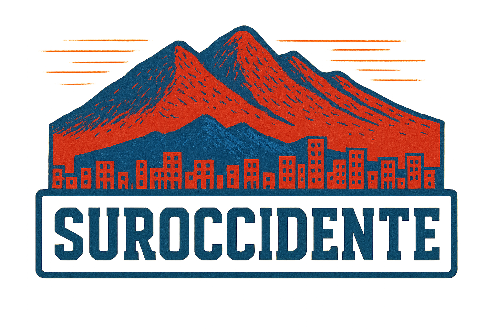

<!-- 
SECCIÓN DEL GIF (CAMBIADO A IMAGEN LOCAL)
Aquí solo reemplaza "mi_imagen.png" por la imagen que quieras en tu carpeta ./assets/
-->

<!-- Social icons section -->
<h1 align="center"> Redes Sociales: </h1>

  

  

<!-- Sobre mí -->
<h2 align="center"> 🗿​ Sobre mí 👨‍💻 </h2>

¡Eyyy!  
Soy <b>Fabián Salamandra</b>, mejor conocido como <strong>'CACIQUE' 🐐​</strong>  
Soy de <strong>Colombia 🇨🇴</strong> ☕  
Autodidacta, apasionado por el desarrollo y actualmente trabajo como <strong>Analista de Sistemas</strong> 💻  
Sigo la <strong>cultura Hip Hop</strong> 🎤 y me inspiro en la <strong>música</strong> y la <strong>moda</strong> para crear y expresarme 🎶👕  
Me gusta <strong>emprender</strong> y siempre estoy en busca de nuevos retos y proyectos increíbles con el ❤️  

<!-- Lenguajes y frameworks -->
<h1 align="center"> Lenguajes/Frameworks en los que soy bueno: </h1>

  <code></code>
  <code></code>
  <code></code>
  <code></code>
  <code></code>
  <code></code>
  <code></code>
  <code></code>
  <code></code>
  <code></code>
  <code></code>
  <code></code>

  

<h1 align="center"> Lenguajes/Frameworks que estoy aprendiendo: </h1>

  <code></code>
  <code></code>
  <code></code>

<h1 align="center"> Entornos con los que trabajo: </h1>

  <code></code>
  <code></code>
  <code></code>
  <code></code>
  <code></code>

